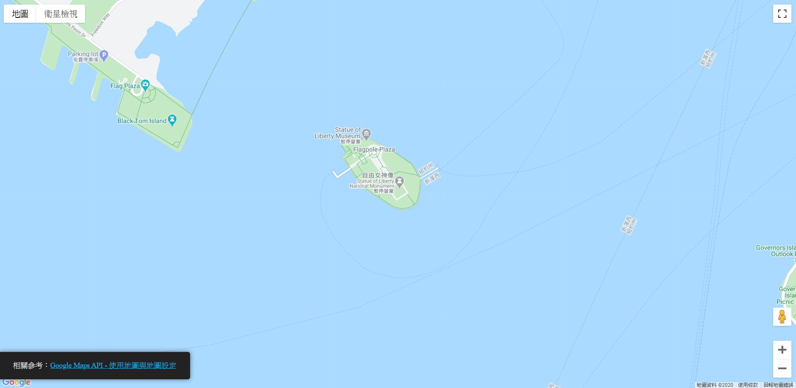
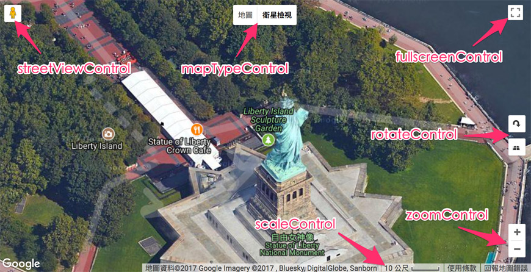
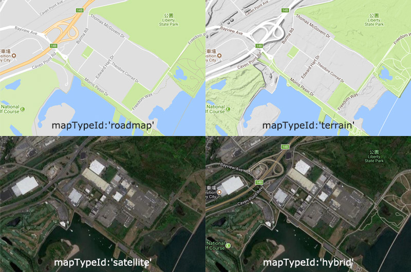

# README

這個資料夾記錄我學習 [Google Maps API - 使用地圖與基本設定](https://www.oxxostudio.tw/articles/201707/google-maps-2-map-class.html) 文章的過程與成果。

- demo/: 存放學習撰寫的網頁。
- reference/: 存放學習的文章。

## 檔案功能

- demo01: 載入地圖
- demo02: 學習 MapOptions 控制項調整
- demo03: 學習 MapOptions 控制項調整

- 官方版 demo01

- 官方版 demo02

- 官方版 demo03

## 語法筆記

**Google javascript maps的function:**

- new google.maps.Map(mapDiv:Element, opts?:MapOptions)

  - MapOptions(必要屬性)
    - center: 中心點經緯度，center 是一個物件，物件內分別有 lat(緯度)與 lng(經度)兩個屬性。
    - zoom: 預設縮放大小，zoom 的數值可從 0 到 21，也可以透過其他設定屬性，指定最小與最大值。

  - MapOptions 控制項(不是必要屬性)，控制項都是用 true 和 false 作切換，true 會顯示，false 則不會顯示控制項
    - mapTypeControl: 預設 true，地圖與衛星類型。
    - streetViewControl: 預設 true，地圖與街景切換。
    - fullscreenControl: 預設 false，全螢幕地圖。
    - rotateControl: 預設 false，旋轉 45 度地圖，必須放大到一定程度才會出現，若不支援 45 度的地圖則不顯示。
    - scaleControl: 預設 false，比例尺。
    - zoomControl: 預設 true，放大縮小地圖。

  - 位置設定內容可以參考 [控制項定位](https://developers.google.com/maps/documentation/javascript/controls#ControlPositioning)，樣式可以參考 [控制項選項](https://developers.google.com/maps/documentation/javascript/controls#ControlOptions)。
    - mapTypeControlOptions: 地圖與衛星類型 UI，位置預設左上方
    - fullscreenControlOptions: 全螢幕地圖 UI，位置預設右上方
    - rotateControlOptions: 旋轉 45 度地圖 UI，位置預設右下方
    - scaleControlOptions: 比例尺 UI，位置預設右下方
    - streetViewControlOptions: 地圖與街景切換 UI，位置預設右下方
    - zoomControlOptions: 放大縮小地圖 UI，位置預設右下方

  - MapOptions 其他屬性
    - clickableIcons(true/false)地點標記能否點擊，預設 true 當我們用滑鼠點擊地圖上的地點標記，會彈出資訊視窗說明。
    - disableDefaultUI(enabled/disabled)顯示或隱藏預設 UI，預設 enabled 的 UI 會顯示相關控制項的 UI。
    - disableDoubleClickZoom(enabled/disable)可否滑鼠點兩下放大地圖，預設 enabled 滑鼠連點兩下地圖會放大。
    - scrollwheel(true/false)是否支援滑鼠滾輪，預設 true 可用滑鼠滾輪縮放地圖。
    - draggable(true/false)可否拖曳移動地圖，預設 true 可以用滑鼠拖曳移動地圖。
    - keyboardShortcuts(true/false)是否支援鍵盤熱鍵，預設 true 可以。
    - tilt(0/45)指定衛星圖的顯示方式，數字 0 是 0 度(正上方往下看)，數字 45 則是 45 度地圖(如果該地區地圖不支援 45 度則一律以 0 度顯示)。
    - heading: 若地圖支援 45 度地圖，可設定旋轉的方向(每 90 度為一個單位)。
    - mapTypeId: 地圖類型，共有四種：hybrid、roadmap、satellite 和 terrain，hybrid 是地圖與衛星空照圖合在一起，roadmap 則是純粹地圖，satellite 是純粹衛星空照圖，terrain 則是地圖與地形圖合在一起(參考 blog_demo03.html)。
    - noClear(true/false)是否清除地圖 div，預設 false。
    - styles: 陣列形式，表示這個地圖顯示出來的樣式。
    - maxZoom: 地圖最大縮放尺寸。
    - minZoom: 地圖最小縮放尺寸。
    - backgroundColor: 地圖背景顏色，背景色表示地圖尚未載入之前的背景色，和 CSS 設定比較不一樣的地方，CSS 呈現的是 div 的背景色，而這個屬性是  - 地圖在初始化時的背景色。
    - draggableCursor: 在可拖曳的地圖下，滑鼠的游標圖案，設定方式和 CSS 相同。
    - draggingCursor: 正在拖曳的地圖裡，滑鼠的游標圖案，設定方式和 CSS 相同。

