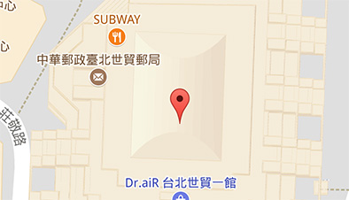
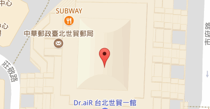
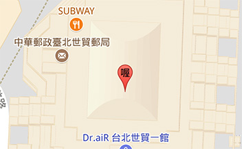
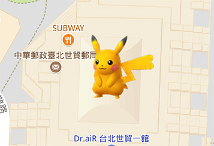
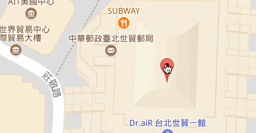
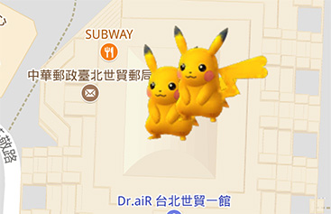

# README

這個資料夾記錄我學習 [Google Maps API - 地圖標記 ( Marker ) - OXXO.STUDIO](https://www.oxxostudio.tw/articles/201801/google-maps-3-marker.html) 文章的過程與成果。

- demo/: 存放學習撰寫的網頁。
- reference/: 存放學習的文章。

## 檔案功能

- demo01: 放置地圖標記
- demo02: 地圖標記動畫(Marker Animations)
  - marker 載入時掉落
  - marker 不斷彈跳
- demo03: 地圖標記標籤(Marker Labels)
- demo04: 地圖標記圖案(Marker Icons)
- demo05: 可拖曳地圖標記(draggable)
- demo06: 地圖標記階層(zIndex)
- demo07: 滑鼠移動會改變顏色

- 官方版 demo01: 放置地圖標記  

- 官方版 demo02: 地圖標記動畫(Marker Animations)
  - marker 載入時掉落
  - marker 不斷彈跳  

- 官方版 demo03: 地圖標記標籤(Marker Labels)
  - 單一個中文字、英文字母或數字比較恰當
  - 如果需要修改 label 的顏色，可以透過{text:顯示文字, color:顏色}來設定。  

- 官方版 demo04: 地圖標記圖案(Marker Icons)  

- 官方版 demo05: 可拖曳地圖標記(draggable)  

- 官方版 demo06: 地圖標記階層(zIndex)  

- [其他的地圖標記屬性 Google Maps JavaScript API V3 Reference  |  Google Developers](https://developers.google.com/maps/documentation/javascript/reference?hl=zh-tw#MarkerOptions)

- 網路範例 demo: 滑鼠移動會改變顏色。

## 語法筆記

**Google javascript maps的function:**

- new google.maps.Marker()
