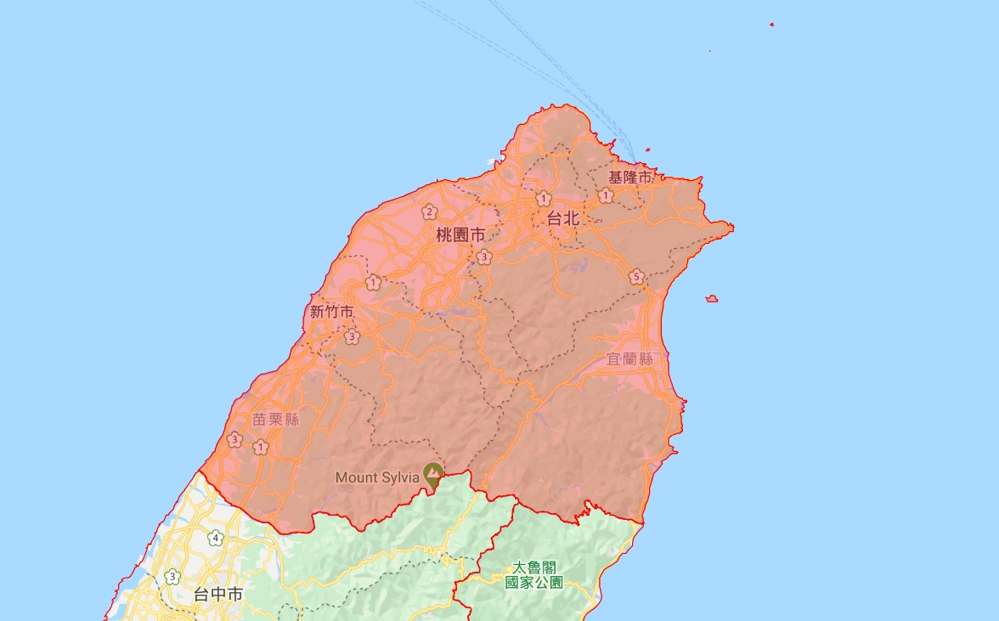

# README

https://www.oxxostudio.tw/articles/201707/google-maps-1.html
https://www.oxxostudio.tw/list.html

## 緣由

有一次正國問說，如果有給出地圖上兩個相鄰區塊的邊界，  
可不可以透過資料處理，將邊界融合，使剩下外框的boundary。  

概念想像圖:

加上自己對圖資類型的資料有興趣，  
所以決定問問看有沒有相關資料可以給我玩玩看。

結果正國就丟給我一個很完整的教學blog，所以我決定趁平常專案還沒有新進度時，將這個blog的文章自己操作一遍~

## 專案目標與架構

將這個 blog [OXXO.STUDIO](https://www.oxxostudio.tw/)底下，Google map 相關的文章，  
跟著實際操作一遍。

每一個blog會放到一個資料夾中，以XX_YYYYMMDD作為資料夾名稱。(XX: 為blog的依序編號、YYYYMMDD: 操作學習日期)

- reference/: 放入所有參考資料

## 所有參考文章列表

主要資料都是參考這個正國推薦給我的網站 [OXXO.STUDIO](https://www.oxxostudio.tw/)，  
依循人家的足跡好好認識一下 Google Maps API 吧!!

- [Google Maps API - 網頁載入地圖(起手式)](https://www.oxxostudio.tw/articles/201707/google-maps-1.html)
- [Google Maps API - 使用地圖與基本設定](https://www.oxxostudio.tw/articles/201707/google-maps-2-map-class.html)
- [Google Maps API - 地圖標記(Marker)](https://www.oxxostudio.tw/articles/201801/google-maps-3-marker.html)
- [Google Maps API - 多個地圖標記](https://www.oxxostudio.tw/articles/201801/google-maps-4-more-markers.html)
- [Google Maps API - 地圖標記點擊事件](https://www.oxxostudio.tw/articles/201801/google-maps-5-marker-click-event.html)
- [Google Maps API - 設計地圖標記圖案](https://www.oxxostudio.tw/articles/201801/google-maps-6-marker-image.html)
- [Google Maps API - 地理編碼服務(地址定位)](https://www.oxxostudio.tw/articles/201802/google-maps-7-geocoding.html)
- [Google Maps API - 資訊視窗(Infowindow)](https://www.oxxostudio.tw/articles/201802/google-maps-8-infowindow.html)
- [Google Maps API - 繪製折線(Polyline)](https://www.oxxostudio.tw/articles/201802/google-maps-9-polyline.html)
- [Google Maps API - 在折線裡加入符號(symbols)](https://www.oxxostudio.tw/articles/201802/google-maps-10-polyline-symbols.html)
- [Google Maps API - 形狀(多邊形 Polygon)](https://www.oxxostudio.tw/articles/201802/google-maps-11-polygon.html)
- [Google Maps API - 形狀(圓形、矩形)](https://www.oxxostudio.tw/articles/201802/google-maps-12-rect-circle.html)
- [Google Maps API - 熱度圖(Heatmap)](https://www.oxxostudio.tw/articles/201802/google-maps-13-heatmap.html)
- [Google Maps API - 顯示 GeoJSON 資料](https://www.oxxostudio.tw/articles/201803/google-maps-14-geojson.html)
- [Google Maps API - 顯示台灣縣市(GeoJSON)](https://www.oxxostudio.tw/articles/201803/google-maps-15-geojson-taiwan.html)
- [Google Maps API - 點擊區域，出現資訊視窗](https://www.oxxostudio.tw/articles/201803/google-maps-16-taiwan-infowindow.html)
- [Google Maps API - 自訂地圖樣式風格](https://www.oxxostudio.tw/articles/201803/google-maps-17-edit-style.html)
- [Google Maps API - 顯示海拔高度](https://www.oxxostudio.tw/articles/201803/google-maps-18-elevation.html)
- [Google Maps API - 路線規劃](https://www.oxxostudio.tw/articles/201810/google-maps-19-directions.html)
- [Google Maps API - 取得目前經緯度並標記](https://www.oxxostudio.tw/articles/201810/google-maps-20-get-current-position.html)
